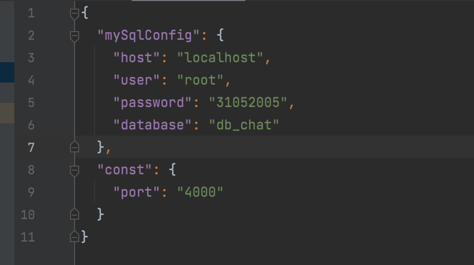
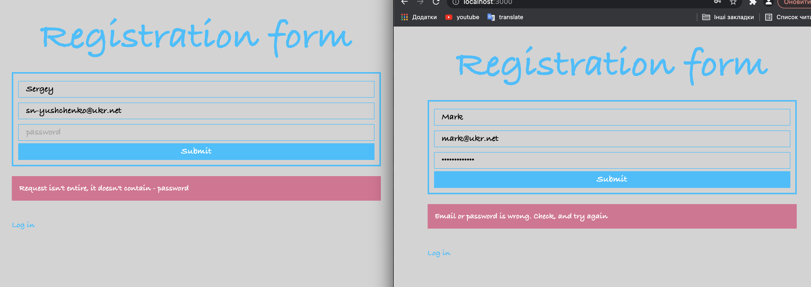
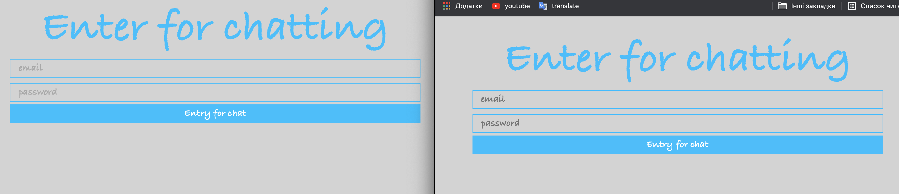
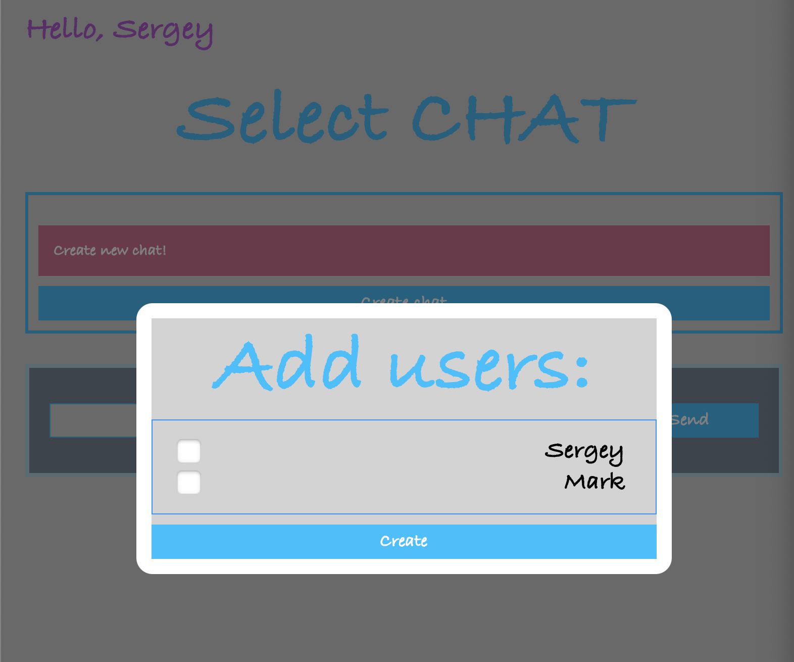
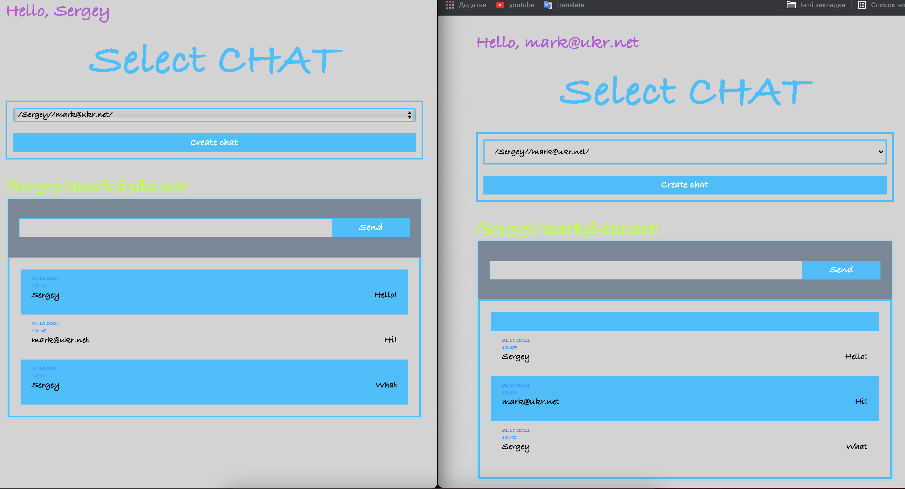

&nbsp;&nbsp;
# ___CHAT_V_1___
___
## ___Table of Contents___
* [DESCRIPTION](#description)
    * [Instalation](#instalation)
* [SETTINGS](#settings)
* [LAUNCHING](#launching)
* [USAGE](#usage)


___
# CHAT_V_1 <a id="description"></a>

    This chat you can use for writing with everybody who is connected to this Server. You can cerate you personal rooms for private writting

## Installation <a id="instalation"></a>

     Bellow you can find out descriding procces installation and list of tools which are necessary for futher work.  
___

* First things first you need to have such tools witch have to be installed on your computer:

    * ___Database management system MySql___. You can read how to install this system following [this link](https://dev.mysql.com/doc/mysql-installation-excerpt/5.7/en/). Link for [downloading](https://dev.mysql.com/downloads/mysql/).  
      I also recommend to watcth [video](https://www.youtube.com/watch?v=n1zT1OZcgnw) for understanding how to configure Mysql.
    * ___Any text redactor, where you can open project.___ I can propose you [WebStorm](https://www.jetbrains.com/ru-ru/webstorm/). You can try using it during 30-days free.
    * [___NodeJS___](https://nodejs.org/en/). [Video instraction](https://www.youtube.com/watch?v=JINE4D0Syqw). NPM (package manager) have been added to this installation.
    * [Git](https://git-scm.com/book/en/v2) - for downloading the project from remote repository.
    * Any browser for testing requests.
___

* If you have already had all tools, let's go to installation CHAT_LIGHT on your computer:
    * Open terminal on your computer and follow to folder with your project, for instance: ```cd /Users/macbook/Project```
    * To download CHAT_LIGHT, execute this command ```git clone https://github.com/sergeyYushchenko1987/chat_v_1``` and app will set in your folder.
    * Install all dependencies which are neсessary for work from package.json ```npm install```.

___

# Settings <a id="settings"></a>


    You should do some settings before can use CRUD. Follow this instruction for the right work of code.
___
* Upload database to MySql:
    * Launch you MySql ```mysql -u <username> -p <password>```. Create new database ```CREATE DATABASE <nameDataBase>;```
    * Follow folder where you save crud ```cd /Users/macbook/Project/crud_v_1``` and execute the command ```mysql -u <username> -p <nameDataBase> < <dump.sql>```
* Next you need to fill in configuration file ```default.json``` which you can find in folder ```config``` in project. PORT - server's port
  

___

# Launching <a id="launching"></a>

    Execute next command from your terminal:
* node app
* launch browser on host where you installed application.
* launch client site: follow the folder client and run client side(npm start)
___
___You can go to testing after server will be launched.___
___


# Usage  <a id="usage"></a>

    Before use the chat you shoud registratin and autorization users.


    Create chat.


    You can use this package. All messages which you will sent in chat will write to database and sent all users who are in chat.

     
____